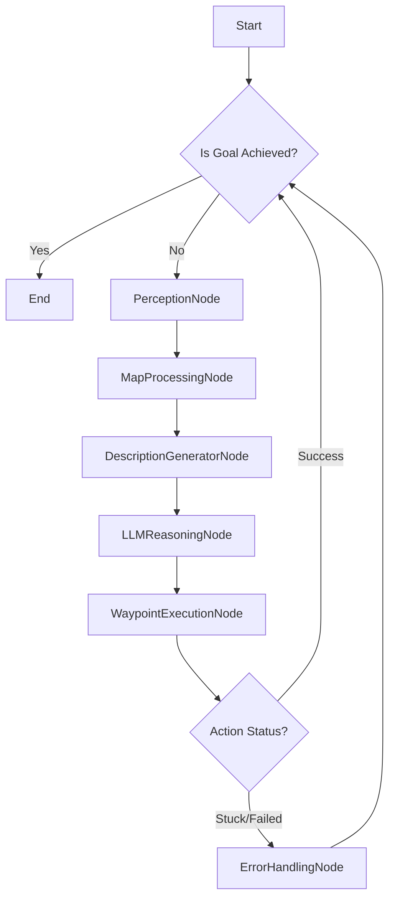

# 💎 全球精英 AI 论文日报 (2026-03-28)

## 🏆 今日深度解剖：VoroNav: Voronoi-based Zero-shot Object Navigation with Large Language Model
- **级别**: 🏆 顶级期刊: International Conference on Machine Learning | **总引用**: 78 | **高影响力引用**: 8
- **阅读链接**: https://www.semanticscholar.org/paper/2653cf21108048bdc9300e7c8daf27461b91f98c

作为一名任职于 OpenAI/DeepMind 的首席科学家，我将以最严苛的学术标准，对 VoroNav 这篇论文进行深度解剖。

---

## VoroNav: Voronoi-based Zero-shot Object Navigation with Large Language Model

### 1. 【范式转移：解决痛点】

VoroNav 试图解决的核心痛点是 **Zero-Shot Object Navigation (ZSON)** 任务中，机器人面对**未知环境**和**未见物体类别**时，传统方法在**泛化能力**和**语义理解**上的严重不足。

*   **传统痛点：**
    *   **数据依赖性强：** 现有导航系统往往需要大量特定环境或物体类别的训练数据，难以泛化到新场景。
    *   **语义鸿沟：** 机器人感知到的低级几何信息（点云、深度图）与人类指令中的高级语义（“找到冰箱”、“去客厅”）之间存在巨大鸿沟。
    *   **探索效率低下：** 在未知环境中，如何高效、安全地探索并定位目标，是一个长期挑战。盲目探索不仅耗时，还可能导致碰撞。
    *   **缺乏常识推理：** 传统方法难以利用人类的常识知识（例如，“冰箱通常在厨房里”，“椅子旁边可能有桌子”）来指导导航。

*   **VoroNav 的范式转移：**
    *   **从“感知-行动”到“感知-推理-行动”：** VoroNav 的核心创新在于将 LLM 引入导航回路，将高层语义推理从机器人本体的感知-行动循环中解耦出来，交由 LLM 处理。这使得机器人能够利用 LLM 庞大的世界知识和常识推理能力，弥补自身在语义理解上的不足。
    *   **几何拓扑与语义推理的融合：** 论文巧妙地将经典的机器人学方法（Voronoi 图）用于提取环境的拓扑结构和安全路径，解决了探索效率和避障问题；同时，通过精心设计的文本描述，将这些几何和语义信息转化为 LLM 可理解的输入，实现了两者的高效协同。
    *   **“零样本”的真正落地：** 通过 LLM 的泛化能力，机器人无需针对每个新物体或新环境进行显式训练，而是通过对环境的实时感知和 LLM 的常识推理，实现真正的零样本导航。这极大地提升了系统的灵活性和部署潜力。

这种范式转移，本质上是将机器人导航的“大脑”部分，从一个纯粹的感知-控制系统，升级为一个能够进行高层语义理解和常识推理的“智能体”，从而在复杂、开放世界环境中实现更高级别的自主性。

### 2. 【第一性原理：底层逻辑】

VoroNav 的底层逻辑建立在几个核心的“第一性原理”之上：

1.  **信息压缩与抽象：** 机器人传感器获取的原始数据是海量且低级的。为了让 LLM 能够高效处理，必须将这些数据进行**有损压缩和高级抽象**。VoroNav 通过构建**语义地图**（几何+语义标签）和提取**Reduced Voronoi Graph (RVG)**（拓扑骨架），将复杂的环境信息提炼为结构化的、可推理的表示。
2.  **模态转换与接口设计：** LLM 的输入是文本，而机器人感知的是视觉、深度等非文本信息。因此，**高效且富有信息量的模态转换**是关键。VoroNav 设计了“路径描述”和“远见描述”两种文本形式，将 RVG 的拓扑结构、语义地图中的物体信息以及潜在的探索方向，转化为 LLM 可理解的自然语言，这是一种**精心设计的“认知接口”**。
3.  **常识推理的杠杆效应：** LLM 经过海量文本训练，内化了丰富的世界知识和常识。其底层逻辑是，通过**将导航决策问题转化为一个基于常识的推理问题**，可以利用 LLM 强大的泛化能力，避免为每个特定场景进行显式编程或训练。例如，“找咖啡机”时，LLM 会基于常识推断咖啡机可能在厨房或办公室的茶水间。
4.  **几何鲁棒性与语义灵活性的互补：**
    *   **几何鲁棒性：** Voronoi 图作为一种经典的路径规划工具，其核心优势在于提供**最大间隙路径**，天然具备避障能力和拓扑稳定性。这是机器人安全、高效移动的物理基础。
    *   **语义灵活性：** LLM 提供了对目标物体、环境区域的**高层语义理解**，以及基于常识的**灵活推理**能力。
    *   **互补逻辑：** VoroNav 的底层逻辑是让两者各司其职，取长补短。几何部分负责“如何安全地走”，语义部分负责“往哪里走”和“为什么往那里走”。

从第一性原理来看，VoroNav 试图构建一个**分层、模块化**的智能体架构，其中低层负责感知和运动控制的物理实现，高层负责基于抽象信息进行语义推理和决策，并通过精心设计的接口进行信息传递和指令下达。

### 3. 【技术解剖：关键机制】

VoroNav 的技术核心在于其巧妙的模块化设计和信息流转机制：

1.  **实时语义地图构建 (Real-time Semantic Map Construction):**
    *   **机制：** 机器人通过 RGB-D 传感器获取环境数据，结合 SLAM 技术构建几何地图（例如，占用栅格图或点云地图），并利用预训练的语义分割或物体检测模型，实时地为地图中的区域或物体赋予语义标签（例如，“墙壁”、“地板”、“椅子”、“厨房”）。
    *   **作用：** 这是整个系统的基础，提供了机器人对环境的**几何和语义理解**。它不仅告诉机器人“哪里是障碍物”，还告诉机器人“哪里是什么区域/物体”。
    *   **关键挑战：** 实时性、准确性、鲁棒性（对光照、纹理、遮挡的适应性）。

2.  **Reduced Voronoi Graph (RVG) 提取：**
    *   **机制：** 在构建好的语义地图的自由空间上，计算其 Voronoi 图。Voronoi 图的边线到所有障碍物的距离都相等，因此提供了**最大间隙路径**。论文中的“Reduced”暗示了对原始 Voronoi 图进行了简化、剪枝或骨架化，以减少冗余节点和边，使其更适合作为规划节点。这些节点和边构成了探索的拓扑骨架。
    *   **作用：**
        *   **探索路径：** 提供了一系列安全、无碰撞的潜在探索路径。
        *   **规划节点：** RVG 的节点可以作为 LLM 决策的候选“路点”或“兴趣点”。
        *   **拓扑信息：** 编码了环境的连通性和结构。
    *   **关键挑战：** RVG 的实时更新效率，在动态环境中的适应性，以及如何有效“Reduced”而不丢失关键信息。

3.  **文本描述生成 (Text-based Descriptions):**
    *   **机制：** 这是连接机器人感知与 LLM 推理的“翻译层”。VoroNav 生成两种关键描述：
        *   **路径描述 (Path Description):** 描述当前机器人所在位置、周围环境的语义信息（如“你现在在一个走廊里，前方有一个门，左边是客厅”），以及沿着 RVG 某条路径前进可能遇到的情况。
        *   **远见描述 (Farsight Description):** 描述从 RVG 中某个关键节点（例如，一个交叉路口或一个未探索区域的入口）向远处看能看到什么。这可能包括远处物体的语义标签、它们的相对位置，甚至是对潜在视觉线索的描述。
    *   **作用：** 将复杂的几何、拓扑和语义信息，转化为 LLM 能够理解和推理的自然语言上下文，为 LLM 提供决策所需的“世界观”。
    *   **关键挑战：** 描述的简洁性、准确性、信息量和无歧义性。如何平衡细节与泛化，避免信息过载或不足。

4.  **LLM 进行常识推理与路点选择 (LLM for Commonsense Reasoning & Waypoint Ascertainment):**
    *   **机制：** LLM 接收目标物体（例如，“冰箱”）以及上述生成的路径描述和远见描述作为输入。基于其预训练的常识知识（例如，“冰箱通常在厨房里”，“厨房可能在客厅旁边”），LLM 对这些描述进行推理，并从 RVG 提供的候选路点中，选择一个最有可能导向目标的路点。
    *   **作用：** 利用 LLM 强大的语义理解和推理能力，将高层目标转化为具体的导航决策，指导机器人进行高效探索。
    *   **关键挑战：** LLM 推理的准确性、鲁棒性（避免幻觉）、实时性，以及如何将 LLM 的文本输出（例如，“选择通往厨房的路口”）精确地映射回 RVG 中的某个具体路点。

5.  **协同与反馈 (Synergy and Feedback):**
    *   **机制：** 机器人执行 LLM 选择的路点，移动到新位置，然后重新进行感知、地图构建、RVG 提取和描述生成，形成一个闭环。路径描述提供局部上下文，远见描述提供全局视野，两者协同作用，避免机器人陷入局部最优或盲目探索。
    *   **作用：** 确保导航过程的动态适应性和持续优化。

这些机制共同构成了一个强大的 ZSON 框架，通过将经典机器人学与前沿 LLM 技术深度融合，实现了在未知环境中高效、智能的物体导航。

### 4. 【批判性思考：大牛视角】

作为一名首席科学家，我对 VoroNav 的贡献表示肯定，它在 ZSON 领域迈出了重要一步。然而，从更深层次和未来发展的角度来看，仍有以下几点值得批判性思考和深入探讨：

1.  **LLM 的“黑箱”与可解释性鸿沟：**
    *   **问题：** 尽管 LLM 提供了强大的常识推理能力，但其决策过程依然是一个“黑箱”。当 LLM 做出错误的路点选择时，我们很难诊断是感知输入错误、描述生成不当，还是 LLM 本身推理失误。这在安全攸关的机器人应用中是致命的。
    *   **挑战：** 如何设计机制，让 LLM 不仅给出决策，还能提供**决策依据**（例如，“我选择这条路，因为描述中提到它通向一个‘厨房’区域，而冰箱通常在厨房”），从而提高系统的可信度和可调试性。
    *   **未来方向：** 结合可解释 AI (XAI) 技术，探索 LLM 内部推理路径的可视化或文本解释生成。

2.  **感知误差的累积与 LLM 的鲁棒性：**
    *   **问题：** VoroNav 的性能高度依赖于实时语义地图的准确性。如果语义分割或物体检测出现错误（例如，将椅子误识别为桌子，或漏检关键物体），或者 SLAM 漂移导致几何地图不准确，这些错误会通过文本描述传递给 LLM。LLM 的推理能力再强，也无法弥补“垃圾输入”带来的问题。
    *   **挑战：** 如何量化和缓解感知模块的误差对 LLM 决策的影响？LLM 对输入描述中的噪声和不确定性有多鲁棒？
    *   **未来方向：** 引入不确定性感知（Uncertainty-aware Perception）和不确定性推理（Uncertainty-aware LLM Reasoning），让 LLM 能够识别并处理输入中的不确定性，甚至主动要求更多信息或采取保守策略。

3.  **文本描述的局限性与信息瓶颈：**
    *   **问题：** 将所有环境信息压缩成文本，必然会丢失大量细节和上下文。例如，一个物体的精确三维位置、纹理、光照等信息，很难通过简洁的文本描述传递给 LLM。这可能限制 LLM 进行更精细、更具空间感的推理。
    *   **挑战：** 如何在文本描述的简洁性和信息量之间取得平衡？是否需要引入多模态 LLM (MLLM)，直接处理图像和文本，以避免信息损失？
    *   **未来方向：** 探索更丰富的多模态接口，例如，LLM 可以直接“看”到当前视角的图像，并结合文本描述进行推理。或者，让 LLM 能够查询地图中的特定区域，获取更详细的几何或语义信息。

4.  **动态环境与实时性：**
    *   **问题：** Voronoi 图通常假设环境是静态的。在动态环境中（例如，有人走动、门开合），RVG 的实时更新和避障策略会变得非常复杂。同时，大型 LLM 的推理延迟可能不满足机器人实时决策的需求。
    *   **挑战：** 如何将 VoroNav 扩展到动态环境？如何优化 LLM 推理速度，或采用更轻量级的模型？
    *   **未来方向：** 结合预测模型（Predictive Models）来预判动态障碍物的行为。探索边缘计算或模型蒸馏技术，将 LLM 部署到机器人本地，减少通信延迟。

5.  **泛化能力的边界与“常识”的局限：**
    *   **问题：** LLM 的常识来源于其训练数据，主要反映人类世界的普遍规律。对于一些非常规、特定领域或需要专业知识的导航任务，LLM 的常识可能不足。例如，在工厂环境中寻找特定型号的设备，或在灾难现场寻找幸存者。
    *   **挑战：** 如何为 LLM 注入特定领域的知识？如何处理 LLM 无法推理或给出错误推理的情况？
    *   **未来方向：** 结合知识图谱 (Knowledge Graphs) 或领域专家系统，为 LLM 提供补充信息。引入人类反馈机制，让 LLM 能够从错误中学习并改进其常识推理。

6.  **与端到端学习的比较：**
    *   **问题：** 随着具身 AI (Embodied AI) 和多模态大模型的发展，端到端学习的导航策略也取得了显著进展。VoroNav 的模块化架构虽然可解释性强，但其各模块之间的接口和潜在的误差传播，是否会限制其最终性能？
    *   **挑战：** 在哪些场景下，VoroNav 的混合架构优于端到端学习？反之亦然？如何从理论上分析两种范式的优劣？
    *   **未来方向：** 探索混合架构与端到端学习的融合，例如，用 VoroNav 的高层规划指导端到端的低层控制，或者用端到端模型来优化 VoroNav 中的某个模块（如描述生成）。

总而言之，VoroNav 是一项令人兴奋的工作，它为 ZSON 任务提供了一个有前景的解决方案。但要真正实现通用、鲁棒、安全的具身智能，我们还需要在上述挑战上进行更深入的探索和突破。

### 5. 【开发者行动手册：LangGraph/Agent 落地】

如果要在 LangGraph 或其他 Agent 框架中落地 VoroNav，我会将其设计为一个多智能体协作系统，或者一个具有复杂状态管理和工具调用的单智能体。以下是我的行动手册：

#### **核心智能体：VoroNav Agent**

这个 Agent 将是整个系统的协调者，负责管理状态、调用工具和驱动决策循环。

#### **LangGraph 节点 (Nodes) 设计：**

1.  **`PerceptionNode` (感知节点):**
    *   **输入：** 原始传感器数据 (RGB-D 图像, IMU)。
    *   **输出：**
        *   `semantic_map`: 实时更新的语义地图（包含几何和语义信息）。
        *   `current_pose`: 机器人当前精确位姿。
        *   `object_detections`: 当前视野内的物体检测结果（类别、边界框、置信度）。
    *   **工具/模块：** SLAM 模块、语义分割模型、物体检测模型。

2.  **`MapProcessingNode` (地图处理节点):**
    *   **输入：** `semantic_map`, `current_pose`。
    *   **输出：**
        *   `reduced_voronoi_graph`: 提取出的 RVG（节点、边、连通性）。
        *   `candidate_waypoints`: 从 RVG 节点中筛选出的潜在路点列表。
        *   `exploration_status`: 当前探索进度、未探索区域信息。
    *   **工具/模块：** Voronoi 图生成算法、图简化算法、探索策略模块。

3.  **`DescriptionGeneratorNode` (描述生成节点):**
    *   **输入：** `semantic_map`, `reduced_voronoi_graph`, `current_pose`, `candidate_waypoints`, `target_object`。
    *   **输出：**
        *   `path_description`: 描述当前路径和周围环境的文本。
        *   `farsight_description`: 描述从候选路点看去可能看到什么的文本。
        *   `prompt_for_llm`: 整合上述描述和目标任务的完整 LLM 提示。
    *   **工具/模块：** 自然语言生成 (NLG) 模块，将结构化数据转化为流畅文本。

4.  **`LLMReasoningNode` (LLM 推理节点):**
    *   **输入：** `prompt_for_llm`, `target_object`。
    *   **输出：**
        *   `selected_waypoint_id`: LLM 选择的下一个路点在 `candidate_waypoints` 中的 ID。
        *   `llm_reasoning_explanation`: LLM 做出选择的简要解释（可选，但强烈推荐）。
        *   `confidence_score`: LLM 对其选择的置信度（可选）。
    *   **工具/模块：** OpenAI GPT-4o, Google Gemini, 或其他大型语言模型 API。

5.  **`WaypointExecutionNode` (路点执行节点):**
    *   **输入：** `selected_waypoint_id`, `reduced_voronoi_graph`, `current_pose`。
    *   **输出：**
        *   `robot_action_status`: 机器人执行动作的状态（成功、失败、卡住）。
        *   `new_current_pose`: 机器人移动后的新位姿。
    *   **工具/模块：** 路径规划器（将路点转换为一系列低级运动指令）、运动控制器、避障模块。

6.  **`GoalCheckNode` (目标检查节点):**
    *   **输入：** `object_detections`, `target_object`, `current_pose`。
    *   **输出：** `goal_achieved` (布尔值)。
    *   **工具/模块：** 目标物体识别与定位模块。

#### **LangGraph 状态 (State) 管理：**

一个共享的 `AgentState` 对象，包含所有节点需要访问和更新的关键信息：

```python
class AgentState(TypedDict):
    target_object: str
    current_pose: Tuple[float, float, float] # (x, y, yaw)
    semantic_map: Any # Representation of the semantic map (e.g., occupancy grid + semantic labels)
    reduced_voronoi_graph: Any # Graph object
    candidate_waypoints: List[Dict] # List of waypoint dicts (id, position, description)
    object_detections: List[Dict] # List of detected objects
    path_description: str
    farsight_description: str
    prompt_for_llm: str
    selected_waypoint_id: Optional[str]
    llm_reasoning_explanation: Optional[str]
    robot_action_status: str # "moving", "stuck", "success", "failed"
    goal_achieved: bool
    history: List[str] # For logging and debugging
```

#### **LangGraph 图结构 (Graph Flow):**



**详细流程：**

1.  **`Start`:** 初始化 `AgentState`，设置 `target_object`。
2.  **`GoalCheckNode`:** 检查目标是否已达成。
    *   如果 `goal_achieved` 为 `True`，则 `End`。
    *   否则，进入 `PerceptionNode`。
3.  **`PerceptionNode`:** 更新 `semantic_map`, `current_pose`, `object_detections`。
4.  **`MapProcessingNode`:** 基于更新的地图，重新计算 `reduced_voronoi_graph` 和 `candidate_waypoints`。
5.  **`DescriptionGeneratorNode`:** 根据当前状态、RVG 和候选路点，生成 `path_description` 和 `farsight_description`，并组装 `prompt_for_llm`。
6.  **`LLMReasoningNode`:** 调用 LLM API，输入 `prompt_for_llm`，获取 `selected_waypoint_id` 和 `llm_reasoning_explanation`。
7.  **`WaypointExecutionNode`:** 将 `selected_waypoint_id` 转换为机器人可执行的低级运动指令，并执行。更新 `robot_action_status`。
8.  **`Action Status Check` (条件边):**
    *   如果 `robot_action_status` 为 "success"，则循环回 `GoalCheckNode` 进行下一轮决策。
    *   如果 `robot_action_status` 为 "stuck" 或 "failed"，则进入 `ErrorHandlingNode`。
9.  **`ErrorHandlingNode`:** 尝试恢复（例如，重新规划、请求 LLM 给出替代方案、执行探索行为），然后循环回 `GoalCheckNode`。

#### **LangGraph/Agent 落地关键考量：**

*   **异步与并行：** 某些节点（如感知、LLM 推理）可能耗时较长，需要考虑异步执行或并行处理。
*   **工具封装：** 每个节点内部的复杂逻辑（如 SLAM、Voronoi 计算、LLM API 调用）应封装为独立的、可复用的工具函数。
*   **状态持久化与回溯：** 为了调试和学习，需要记录 `AgentState` 的历史版本，以便回溯和分析决策过程。
*   **人机协作 (Human-in-the-Loop)：** 可以添加一个节点，在 LLM 决策不确定或机器人卡住时，向人类操作员请求帮助或确认。
*   **评估与优化：** 记录每次导航的成功率、SPL、探索效率、避障表现等指标，用于迭代优化各个模块和 LLM 提示。
*   **LLM 提示工程：** `DescriptionGeneratorNode` 的输出质量直接影响 `LLMReasoningNode` 的性能。需要投入大量精力进行提示工程，确保 LLM 能够准确理解任务和环境上下文。可以考虑使用 Few-shot 示例来引导 LLM。
*   **安全机制：** `WaypointExecutionNode` 内部必须包含强大的低级避障和安全停止机制，独立于 LLM 的高层规划，作为最终的安全保障。

通过这种 LangGraph 架构，我们可以清晰地看到 VoroNav 各个模块如何协同工作，实现从感知到高层推理再到低层执行的完整闭环，同时为未来的迭代和改进提供了清晰的接口和扩展点。

---
